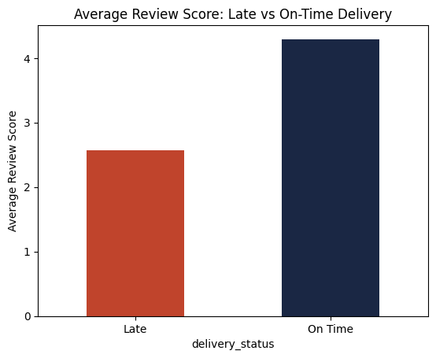

# 📦 Olist E-Commerce Delivery & Retention Analysis

A SQL + Python analysis of **99K+ orders** across a 9-table relational database, investigating whether late delivery genuinely hurts customer satisfaction — and what's actually driving it — for the Olist Brazilian marketplace (2016–2018).

**Tools:** SQL (SQLite) · Python (Pandas, Matplotlib) · **Status:** Complete · **License:** MIT

---

## 📌 Overview

Olist is a Brazilian e-commerce marketplace that connects small sellers to major online marketplaces and handles logistics through third-party delivery partners. This project analyzes ~99,000 real, anonymized orders (2016–2018) spread across 9 relational tables to answer one core question:

> **Is customer dissatisfaction actually caused by late delivery — and if so, is it a category problem or a seller problem?**

A second, related question is also answered: **how much of Olist's revenue depends on repeat customers versus one-time buyers** — since that changes whether fixing delivery is a retention fix, or the business is structurally one-time-purchase by nature.

The analysis joins across 9 relational tables using SQL (orders, order items, sellers, products, reviews, customers), validates the core hypothesis with real aggregate output, then visualizes the headline result in Python — mirroring a real operations-analytics workflow: prove the problem is real, quantify it, and localize it, before recommending a fix.

---

## 🗂️ Data Source

**Dataset:** [Olist Brazilian E-Commerce Public Dataset (Kaggle)](https://www.kaggle.com/datasets/olistbr/brazilian-ecommerce) — 9 relational CSV tables, ~99K orders

| Table | Grain / Role |
|---|---|
| `orders` | One row per order — status, purchase/delivery/estimated dates |
| `order_items` | One row per item within an order — links order to product and seller |
| `customers` | `customer_id` (per order) and `customer_unique_id` (per real person) |
| `sellers` | Seller ID and location |
| `products` | Product ID and category |
| `order_payments` | Payment type, installments, value |
| `order_reviews` | `review_score` (1–5) and review text per order |
| `geolocation` | Zip-code-prefix to lat/long mapping |
| `category_translation` | Portuguese-to-English category name lookup |

---

## 🚀 How to Run

| Step | Action |
|---|---|
| 1️⃣ | Download the dataset: [Olist Brazilian E-Commerce (Kaggle)](https://www.kaggle.com/datasets/olistbr/brazilian-ecommerce) |
| 2️⃣ | Place all 9 CSVs into `/data` |
| 3️⃣ | Run `load_data.py` to build the SQLite database (`olist.db`) |
| 4️⃣ | Open `analysis.ipynb` in Jupyter/VS Code to run the full SQL + Python analysis |

> 💡 All SQL queries are also available standalone in `queries.sql`.

```bash
# Clone the repo
git clone https://github.com/Sushrut001/Ecommerce--Analysis.git
cd Ecommerce--Analysis

# Add the 9 Kaggle CSVs into /data, then build the database
python load_data.py

# Launch the notebook
jupyter notebook analysis.ipynb
```

---

## 🖼️ Screenshot

### Review Score: Late vs On-Time Delivery


*Average review score drops from 4.29/5 (on-time) to 2.57/5 (late) — a 1.72-point gap.*

---

## 🛠️ Tech Stack

- **Database:** SQLite (9-table relational schema, joined via foreign keys)
- **SQL:** Multi-table joins, `CASE` logic, `GROUP BY`, `HAVING`, aggregate subqueries, `julianday()` date arithmetic
- **Python:** pandas (query execution, aggregation), matplotlib (visualization)
- **Tools:** VS Code, Jupyter Notebook
- **Data Source:** [Olist Brazilian E-Commerce Public Dataset (Kaggle)](https://www.kaggle.com/datasets/olistbr/brazilian-ecommerce)

---

## 🔑 Key Findings

| # | Finding | Number |
|---|---|---|
| 1 | 📉 Late orders get much worse reviews | 2.57/5 vs 4.29/5 (**−1.72 pts**) |
| 2 | ⏱️ Share of orders delivered late | **8.1%** (7,826 / 96,470) |
| 3 | 🚩 Worst offending seller's late rate | **50.0%** (23 of 46 orders) |
| 4 | 🎯 Lateness is seller-driven, not category-driven | Categories: **−9 to −10.7 days** (early, on average) |
| 5 | 🔁 Customers who ever re-order | **~3%** (2,801 / 93,358) |

**In plain terms:** late delivery genuinely hurts customer satisfaction — that's proven, not assumed. But the problem isn't spread evenly across the platform; it's concentrated in a small group of chronically underperforming sellers, not any particular product category. Meanwhile, retention is arguably the bigger long-term risk — even satisfied customers mostly don't come back.

---

## 🧮 Core SQL Queries

Every query below was run in this exact order, each one building on the last:

| # | Query | Purpose |
|---|---|---|
| 1 | Sanity check | Confirm delivery date columns are clean and populated |
| 2 | Delay calculation | `julianday()` diff between actual and estimated delivery date |
| 3 | Late vs. on-time split | Overall order-level delivery performance |
| 4 | Review score comparison | Joins `orders` + `order_reviews` to test the core hypothesis |
| 5 | Seller ranking | Joins `order_items` to flag worst-performing sellers (min. 20 orders) |
| 6 | Top repeat buyers | Ranks customers by total order count |
| 7 | Repeat-purchase rate | Subquery grouping customers by order count (one-time vs. repeat) |
| 8 | Category delay breakdown | Joins `products` to rule out category as the driver |

**Example — the core hypothesis test (Query 4):**
```sql
SELECT 
    CASE 
        WHEN julianday(o.order_delivered_customer_date) - julianday(o.order_estimated_delivery_date) > 0 
        THEN 'Late' ELSE 'On Time' 
    END AS delivery_status,
    ROUND(AVG(r.review_score), 2) AS avg_review_score,
    COUNT(*) AS total_orders
FROM orders o
JOIN order_reviews r ON o.order_id = r.order_id
WHERE o.order_status = 'delivered'
  AND o.order_delivered_customer_date IS NOT NULL
GROUP BY delivery_status;
```

**Example — retention via subquery (Query 7):**
```sql
SELECT 
    CASE WHEN order_count = 1 THEN 'One-time customer' ELSE 'Repeat customer' END AS customer_type,
    COUNT(*) AS num_customers
FROM (
    SELECT customer_unique_id, COUNT(DISTINCT o.order_id) AS order_count
    FROM orders o
    JOIN customers c ON o.customer_id = c.customer_id
    WHERE o.order_status = 'delivered'
    GROUP BY customer_unique_id
)
GROUP BY customer_type;
```

> 📄 All 8 queries, with full SQL and real output, are documented end-to-end in `queries.sql` and walked through in `analysis.ipynb`.

---

## 📁 Repository Structure

```
Ecommerce--Analysis/
├── data/                      # (gitignored) raw Kaggle CSVs go here
├── load_data.py                # ETL: builds olist.db from 9 raw CSVs
├── queries.sql                 # All 8 SQL queries, standalone
├── analysis.ipynb              # Full SQL + Python notebook (run this end-to-end)
├── review_score_chart1.png     # Output chart: Late vs On-Time review scores
├── .gitignore                  # Excludes /data and *.db from source control
└── README.md
```

---

## 🙌 Thank You

Thanks for checking this out! I built this to show how raw relational data can be turned into a tested, decision-ready finding — not just a chart.

If you're hiring for a **Data Analyst** role, I'd love to connect.

📩 **Let's connect:** [sushrutworks@gmail.com](mailto:sushrutworks@gmail.com)
🔗 **LinkedIn:** [@linkedin_Sushrut](https://www.linkedin.com/in/sushrutt/)
💻 **Portfolio:** [@sushrut_website](https://sushrut-portfolio.netlify.app/)
